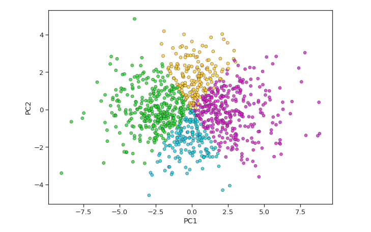
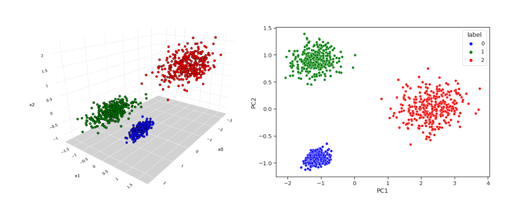
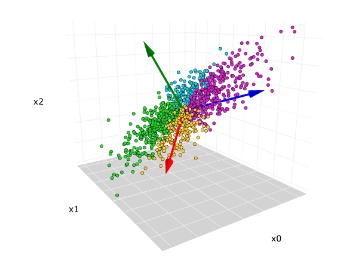

# PCA

https://towardsdatascience.com/principal-component-analysis-pca-explained-visually-with-zero-math-1cbf392b9e7d

# AutoEncoder

https://www.youtube.com/watch?v=Rdpbnd0pCiI

https://towardsdatascience.com/applied-deep-learning-part-3-autoencoders-1c083af4d798

https://www.quora.com/What-are-the-differences-between-PCA-and-a-stacked-autoencoder

### https://medium.datadriveninvestor.com/deep-learning-autoencoders-db265359943e

**Autoencoders are**
- Unsupervised deep machine learning algorithm. Autoencoders don’t use any labelled data.
- Directed neural network
- Learns a lower dimension representation of the input feature

**Where are Auto encoders used ?**
- Used for Non Linear Dimensionality Reduction. Encodes input in the hidden layer to a smaller dimension compared to the input dimension. Hidden layer is later decoded as output. Output layer has the same dimension as input. Autoencoder reduces dimensionality of linear and nonlinear data hence it is more powerful than PCA.
- Used for Feature Extraction : Autoencoders tries to minimize the reconstruction error. In the process to reduce the error, it learns some of important features present in the input. It reconstructs the input from the encoded state present in the hidden layer. Encoding generates a new set of features which is a combination of the original features. Encoding in autoencoders helps to identify the latent features presents in the input data.
- Image recognition : Stacked autoencoder are used for image recognition. We can use multiple encoders stacked together helps to learn different features of an image.
- Used in Recommendation Engines. This uses deep encoders to understand user preferences to recommend movies, books or items.

# RBM

## Restricted Boltzmann Machine and Its Application

https://www.latentview.com/blog/restricted-boltzmann-machine-and-its-application/

As mentioned earlier Restricted Boltzmann Machine is an **unsupervised learning** algorithm , so how does it learn without using any output data?  We have a visible layer of neurons that receives input data which is multiplied by some weights and added to a bias value at the hidden layer neuron to generate output. Then the output value generated at the hidden layer neuron will become a new input which is then multiplied with the same weights and then bias of the visible layer will be added to regenerate input. This process is called reconstruction or backward pass. Then the regenerated input will be compared with the original input if it matches or not. This process will keep on happening until the regenerated input is aligned with the original input.

#### Applications of RBM 

HandWritten Digit Recognition is a very common problem these days and  is used in a variety of  applications like criminal evidence, office computerization, check verification, and data entry applications. It also comes with  challenges like different writing style, variations in shape and size as well as image noise, which leads to changes in numeral topology. In this a hybrid RBM-CNN methodology is used for digit recognition. First, features are extracted using RBM deep learning algorithms. Then extracted features are fed to the CNN deep learning algorithm for classification. RBMs are highly capable for extracting features from input data. It is designed in such a way that it can extract the discriminative features from large and complex datasets by introducing hidden units in an unsupervised manner. 

## What is the difference between convolutional neural networks, restricted Boltzmann machines, and auto-encoders?

https://stats.stackexchange.com/questions/114385/what-is-the-difference-between-convolutional-neural-networks-restricted-boltzma/117188#117188

## Why is the restricted boltzmann machine both unsupervised and generative?

https://stats.stackexchange.com/questions/110706/why-is-the-restricted-boltzmann-machine-both-unsupervised-and-generative

## Generative Model

https://developers.google.com/machine-learning/gan/generative

https://en.wikipedia.org/wiki/Generative_model

https://www.section.io/engineering-education/beginners-intro-to-generative-modeling/

# Semi-supervised learning

https://bdtechtalks.com/2021/01/04/semi-supervised-machine-learning/

https://www.datarobot.com/blog/semi-supervised-learning/

https://www.altexsoft.com/blog/semi-supervised-learning/

